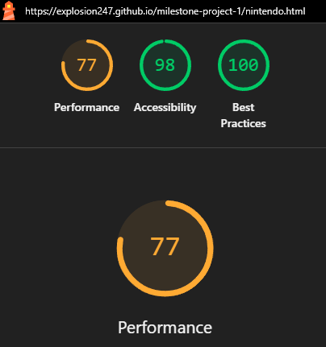

# The SteelBook Collection

[The Steelbook collection](https://explosion247.github.io/milestone-project-1/)

## Site Overview

This project is to create a responsive website, I have chosen to create a website to help you with your video game collection.

one common part of video game collecting is special/limited editions. These special/limited editions often contain a special metal case called a steelbook that is used to show off your game cases.

This website is a designed to help you find new steelbooks or collectors editions that you would like to find. As there could be millions of games, there could be hundreds of thousands of unique steelbooks, this website only lists a few, however there will be more to come in the future.

The Aim Of this website is to make it as easy as possible to find new steelbooks to help people complete their collections, as this is a recently created website, there are only a few games included, however as time goes on i would like to include a wider range of titles.

## Table of Content

[User Experience UX](#user-experience-ux)

[Design](#design)

- [Colours](#colours)
- [Wireframe](#wireframe)

[Deployment](#deployment)

- [Features](#features)
  - [Navigation](#navigation)
  - [Carousel](#carousels)
  - [Cards](#cards)
  - [Information](#information)
  - [Footer](#footer)
  - [Coming Soon](#coming-soon)
- [Testing](#testing)
  - [HTML Validation](#html-validation)
  - [CSS Validation](#css-validation)
  - [Lighthouse Testing](#lighthouse-testing)
  - [Manual Testing](#manual-testing)

[Technologies Used](#technologies-used)

[Credits and References](#credits-and-references)

## User Experience UX

### User stories

- As a steelbook collector i would like to have a place i can see all the different types of steelbooks there are so i can know what steelbook i still need to buy

- As a steelbook collector i would like to have a website with all the steelbooks so i can keep track of my collection

- As a person who place video games i would like to have a website with a lot of different video games so i can find new recommendations

Please view some of the pages below

Main Page

Playstation page

Middle Earth: Shadow of War 

## Design

### Colours

For the colours of this website, i have used two basic colours, white and jet. As this website contains a lot of images, they provide a range of colours for the website.

### Wireframe

When designing this website, i used Balsamiq to make the a clear structure thats easy to understand.

 
Main page Wireframe:

 

During the creating of the main page, i focused on making the main page as clear as possible to the user. During the creation of the website a few things needed to be changed.

- The description was moved to the right of the carousel to prevent large blank spaces
- A welcome paragraph was added above the description
- I removed the third carousel to improve performance on mobile devices

click to view wireframe

 
Game list Wireframe:

 

Click to view wireframe

 
Game page Wireframe:

 
During the creation of this page i had to change two things

- Remove the summary tab because it was the same as the description
- On the smaller screens make the information into a 2x2 grid

click to view wireframe

## Deployment

### Features

One of the main components of this website is the front-end toolkit called bootstrap, there are many different parts of the website that uses bootstrap components. Each of the main component that are used are listed below.

#### Navigation

The navigation uses the bootstrap navbar with a custom logo/image in the the top left. This navbar has been customized to suit the steelbook collection website with the different brands/pages in the top right. This navbar contains the title for the website and will stay in the left when the website is 992 px or wider and when then move to the center when the page is 991 px or smaller. When this change happens the categories will also compress in to a drop down menu.

- Styled with the primary colour for the text and the secondary colour for the navbar
- Allows the user to navigate between each page easily - all the text on the nav bar will take you to a different page

- Uses a dropdown menu to allow for easy access on mobile screens
- The Title will move to the center to make it easier to read on smaller screen

#### Carousels

I have included carousels on each page to allow the user to see games that they might not have seen before or to see the different parts of the steelbooks without having the page filled with multiple photos. The main page has 2 carousels, the top carousel shows examples of different steelbooks while the bottom carousel shows new collectors editions that contain steel books.

- All the carousels will scale to the size of the page
- The carousels with text next to them will move the text below on smaller screens
- Each carousel shows games relevant to the page they are on

#### Cards

I have used cards as a easy way to move between different pages. Using images makes it easier for the user to know what page they are moving to as each page correlates to an image.

#### Information

To make it easier for the user to see the information about each game, the main, short information about each game is listed next/below (on a smaller screen) the image while the description and reviews are on tabs below, this reduces the clutter on the screen and allows the user to choose the information they would like to see.

#### Footer

There is not much information on the footer. The footer is only containing another navbar and then links to the social media. At the moment there are no social media pages however that will change in the future.

#### Coming Soon

As there are parts of the website that i would like to implement in the future but do not have the time, I have created a coming soon page to let people know that these features have not been implemented yet and will be sometime in the future. The Main features that link to this page is the "Xbox" Page as there are no xbox games currently on the website, and there is the "Your Collection" page, this is because the collection page would require more games on the website and JavaScript to create lists and databases within the website.

### Testing

#### HTML Validation

When testing the HTML there were some errors that appeared and have been fixed, they were mainly spaces within file names, and the most common warning was trailing slashes due to prettier being installed, this will automatically add trailing slashes onto self closing tags.

- To fix the file names i renamed them using dashes rather then spaces
- To fix the trailing slashes i searched for /> and replaced it using >

#### CSS Validation

When Testing the CSS there were no errors that appeared in the Validation

#### Lighthouse Testing

During the light house testing, one of the errors that repeatedly appeared is "image elements do not have explicit width and height" this is an error that i have not fixed because during development if i gave the image a set width then it would affect gaps between the cards or the location of the cards, so removing the set size and having set gaps would ensure the cards always stayed the same distance from each other while letting the images scale for different sized devices.

All the light house testing had results in the 90's for desktop tests.

However The testing with mobile resulted in 70s - 80s as the website has a lot of images.

#### Manual Testing

During The production of the website, this website has constantly been manually tested. Each link has been tested to ensure that they work correctly, Each Page has been manually tested at different screen sizes to ensure they work as it should.

## Technologies Used

### Languages

HTML and CSS

Links to JavaScript have been used

## Technology

GitHub

## Credits and References

During the production of this website i have used the following sources:

- Example code from the Board walk games and love running made by Code Institute
- getbootstrap.com
- W3Schools.com
- StackOverflow.com
- Fontawsome.com

Some images are sources from:

- https://collectorseditions.co.uk/
- https://www.amazon.co.uk/Pokemon-Sword-Steelbook/dp/B081LLS6Y4
- https://www.reddit.com/r/PS4/comments/om6t45/my_steelbook_collection_of_the_ps4_era_is_coming/
- https://screenrant.com/playstation-consoles-best-worst-ranked-ps2-ps5-ps4/
- https://en.wikipedia.org/wiki/Nintendo_Switch
- https://commons.wikimedia.org/wiki/File:Playstation_logo_colour.svg
- https://commons.wikimedia.org/wiki/File:Xbox_one_logo.svg
- https://megacatstudios.com/ja/blogs/game-culture/6-tips-building-managing-your-retro-gaming-collection
